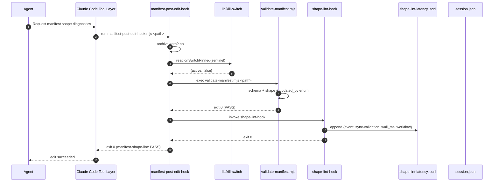
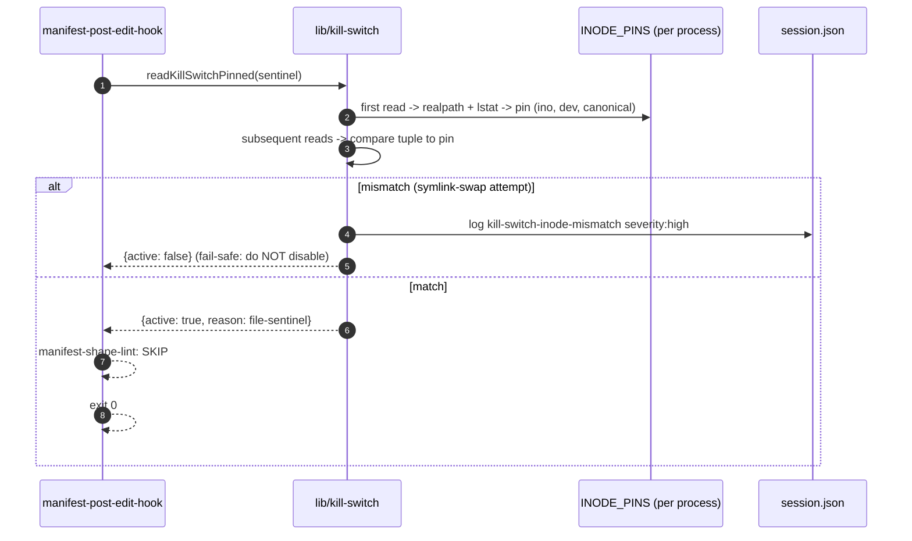
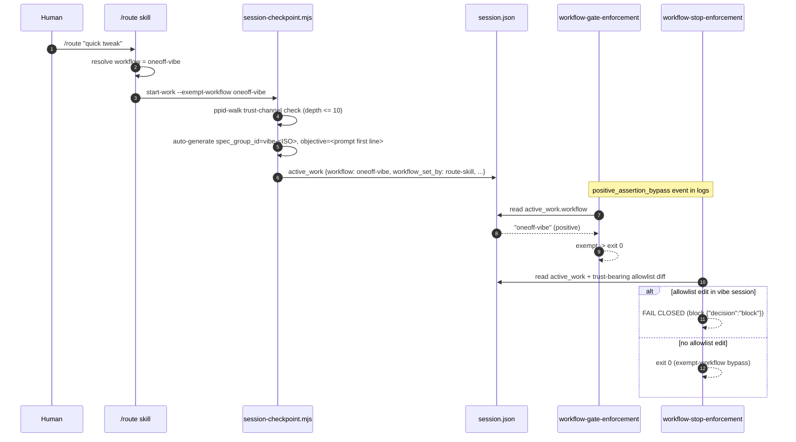

# Enforcement Layer Flows

Architecture reference for two current enforcement-layer control flows:

1. **Manifest validation chain**: `manifest-post-edit-hook` remains available as an ad-hoc wrapper for schema validation and shape-lint, but it is no longer wired as a live PostToolUse hook.
2. **Dispatch-record fallback**: `SubagentStop` hook completes the PreToolUse Agent pre-recording so the Stop hook's mandatory-dispatch check has full audit coverage.

Both flows replace implicit, cooperative drift-prone paths with positive-assertion, fail-safe semantics.

---

## Manifest Validation Flow (M1, Ad Hoc)

This flow documents the shipped wrapper behavior. The simplification pass
removed its live PostToolUse registration because the wrapper never blocks and
only adds advisory output.

### Components

| Component                      | Path                                           | Role                                                                             |
| ------------------------------ | ---------------------------------------------- | -------------------------------------------------------------------------------- |
| Tool layer                     | Manual / phase command                         | Can invoke the wrapper directly when manifest shape diagnostics are needed.       |
| `manifest-post-edit-hook.mjs`  | `.claude/scripts/manifest-post-edit-hook.mjs`  | Wrapper; orders schema-validate then shape-lint; never blocks.                   |
| `validate-manifest.mjs`        | `.claude/scripts/validate-manifest.mjs`        | Schema validator (v2.0, strict nested shape).                                    |
| `shape-lint-hook.mjs`          | `.claude/scripts/shape-lint-hook.mjs`          | Standalone shape-lint with latency tracking + async-mode state machine.          |
| `lib/kill-switch.mjs`          | `.claude/scripts/lib/kill-switch.mjs`          | Inode-pinned sentinel reader + OR-gate env var.                                  |
| `lib/path-validate.mjs`        | `.claude/scripts/lib/path-validate.mjs`        | POSIX path validator (no abs, no `..`, no symlinks).                             |
| `lib/session-lock.mjs`         | `.claude/scripts/lib/session-lock.mjs`         | `acquireLock` / `releaseLock` for latency-log safety.                            |
| `workflow-file-protection.mjs` | `.claude/scripts/workflow-file-protection.mjs` | Protects the kill-switch sentinel from destructive Bash / Edit / Write.          |
| `session.json`                 | `.claude/context/session.json`                 | Host for `history[]` audit events.                                               |
| `.claude/coordination/`        |                                                | Home for sentinels and latency log.                                              |

### Happy-Path Sequence



### Drift-Detected Path

On legacy-flat shape, validator exits 1:

```mermaid
sequenceDiagram
  autonumber
  participant Wrap as manifest-post-edit-hook
  participant SV as validate-manifest.mjs
  participant Sess as session.json
  Wrap->>SV: exec validator
  SV-->>Wrap: exit 1 + stderr (3-part error)
  Wrap->>Sess: log hook-block event {workflow, field, canonical}
  Wrap-->>Wrap: emit "manifest-shape-lint: FAIL"
  Wrap-->>Wrap: exit 0 (non-blocking; CI/CLI is authoritative)
```

The CLI — run from CI or pre-commit — exits non-zero on the same manifest and blocks the commit. Operator runs `migrate-manifest.mjs --all`, re-commits.

### Kill-Switch Short-Circuit

When the sentinel exists OR `DISABLE_SHAPE_LINT=1`:



Pins live for the process lifetime; next invocation re-pins. The CLI ignores both kill switches (AC-2.5).

### Structural-Error Short-Circuit

If `validate-manifest.mjs` exits >= 2 (missing file, malformed JSON), the wrapper emits `manifest-shape-lint: STRUCTURAL_ERROR` and skips shape-lint. Running shape-lint on malformed JSON would emit misleading errors (AC-3.3).

### Async-Mode Auto-Downgrade

This flow is retained for the ad-hoc shape-lint wrapper, not the live hook path. Its controls are summarized in [HOOKS.md § shape-lint-hook.mjs](./HOOKS.md#shape-lint-hookmjs).

---

## Dispatch-Record Fallback Flow (M2)

### Why SubagentStop, Not PostToolUse+Agent

The original design called for a `PostToolUse` hook with `matcher: "Agent"`. Task 22's feasibility probe (`.claude/scripts/__tests__/hook-feasibility-probe.mjs`) confirmed Claude Code does NOT support `PostToolUse+Agent`. Outcome branch: `FALLBACK_PATH_SUBAGENTSTOP`. `AC-9.9` declares this fallback path; `dispatch-record-hook.mjs` implements it on the `SubagentStop` event.

### Components

| Component                       | Path                                            | Role                                                                                                     |
| ------------------------------- | ----------------------------------------------- | -------------------------------------------------------------------------------------------------------- |
| PreToolUse Agent hook           | `.claude/scripts/workflow-gate-enforcement.mjs` | Pre-records dispatch with `status: "in_progress"` and `subagent_type` as authoritative source (SEC-004). |
| `dispatch-record-hook.mjs`      | `.claude/scripts/dispatch-record-hook.mjs`      | SubagentStop handler; matches pre-recorded entry and marks `"completed"`.                                |
| `session-checkpoint.mjs`        | `.claude/scripts/session-checkpoint.mjs`        | Sole writer for `session.json`; exposes `dispatch-subagent` / `complete-subagent` subcommands.           |
| `session.json`                  | `.claude/context/session.json`                  | Stores `active_work.subagent_tasks` and `subagent_tasks_history`.                                        |
| `workflow-stop-enforcement.mjs` | `.claude/scripts/workflow-stop-enforcement.mjs` | Reads `subagent_tasks` to enforce mandatory-dispatch completeness.                                       |

### Sequence

```mermaid
sequenceDiagram
  autonumber
  participant Main as main agent
  participant PreHook as PreToolUse Agent
  participant Task as Task tool
  participant Sub as subagent
  participant Stop as SubagentStop
  participant DR as dispatch-record-hook
  participant SC as session-checkpoint.mjs
  participant Sess as session.json

  Main->>PreHook: Task dispatch (subagent_type=X)
  PreHook->>SC: dispatch-subagent <id> <type> <desc>
  SC->>Sess: append in_flight {status: in_progress, subagent_type: X}
  SC-->>PreHook: ok
  PreHook-->>Main: exit 0 (prereqs met)
  Main->>Task: invoke subagent
  Task->>Sub: spawn
  Sub-->>Task: complete
  Task->>Stop: fire SubagentStop envelope
  Stop->>DR: invoke with {agent_id, agent_type, session_id}
  DR->>Sess: find in_flight by agent_id
  alt agent_type matches PreToolUse record
    DR->>SC: complete-subagent <id> <summary>
    SC->>Sess: mark completed
  else type mismatch
    DR->>Sess: log subagent_type_mismatch_rejected severity:high
    DR->>Sess: increment active_work.type_mismatch_count
    alt 4th mismatch
      DR->>Sess: set enforcement_compromised=true (block all future dispatches)
    end
    DR-->>Stop: exit 0 ("record rejected" generic; AC-11.8)
  end
```

### Last-Write-Wins + Audit Trail

Previously `session-checkpoint.mjs dispatch-subagent` threw on duplicate `task_id` (legacy line 827). That behavior is REPLACED per chk-hook-d5a23f98:

- Overwrite the live `subagent_tasks.in_flight` / `completed_this_session` entry.
- Append to `active_work.subagent_tasks_history` (FIFO cap 500):

  ```json
  {
    "dispatch_id": "<id>",
    "prior_value": { ... },
    "new_value": { ... },
    "timestamp": "<ISO>",
    "event_type": "duplicate-overwrite"
  }
  ```

- Emit stderr warning; log `subagent_dispatched_overwrite` to `history[]`.

Tool-retry scenarios legitimately re-fire dispatch. The hook must not fail-closed on duplicate IDs; the audit array preserves the full trail.

### Trust Channel

`CLAUDE_PROJECT_DIR` is the session-identifying env var (Task 22 sub-check (b) outcome). `dispatch-record-hook` resolves `.claude/` via that variable; fallback is a realpath-walk from the script location.

Subagent-type integrity: the PreToolUse record is authoritative. On PostToolUse / SubagentStop type mismatch, the handler rejects the write generically (no type-hint leakage — AC-11.8) and tracks per-session mismatches. At the 4th mismatch, `enforcement_compromised: true` blocks all subsequent dispatches until operator review (SEC-015 rate limit).

### Untrusted-Agent Fallback

When the SubagentStop payload lacks `agent_type` or reports an unrecognized value, `dispatch-record-hook` records under sentinel `unknown_fallback` rather than trusting the payload field. The pre-recorded PreToolUse entry remains the authoritative type; the fallback only completes the lifecycle.

### Fail-Open Semantics

- stdin unreadable, malformed JSON, missing `session.json`, CLI subprocess crash -> exit 0 with stderr warning.
- Goal: never block subagent completion. Dispatch-record loss is recoverable (future SubagentStop reconciles).

The Stop hook's mandatory-dispatch check (satisfied by any of `dispatched`, `in_progress`, `completed`) tolerates the `in_progress` state from the PreToolUse record even if SubagentStop is lost (TECH-010, AC-9.6).

---

## Vibe-Mode Positive-Assertion Flow (M2)

Complementary to dispatch-record: `/route` writes a positive assertion for exempt workflows instead of skipping `start-work`.



Distinguishable log entries separate positive assertion from fail-open:

- `event=no_active_work assertion_state=missing exit=0_fail_open` — uninitialized session.
- `event=invalid_workflow assertion_state=invalid exit=0_fail_open` — workflow not in `VALID_WORKFLOWS`.
- `event=positive_assertion_bypass assertion_state=positive exit=0_exempt` — legitimate exempt path.

Trust-bearing allowlist (vibe-mode edits that force Stop-hook fail-closed): `scripts/workflow-{gate,stop,file}-*.mjs`, `scripts/dispatch-record-hook.mjs`, `scripts/session-checkpoint.mjs`, `scripts/lib/{workflow-dag,stop-hook-checks,hook-utils,session-lock,atomic-write,sync-constants}.mjs`, `settings.json`.

---

## See Also

- [HOOKS.md](./HOOKS.md) — reference docs for every hook script mentioned here.
- [MANIFEST-MIGRATION.md](./MANIFEST-MIGRATION.md) — operator guide for canonical shape + migration workflow.
- [WORKFLOW-ENFORCEMENT.md](./WORKFLOW-ENFORCEMENT.md) — cooperative / coercive layer architecture, DAG predecessors, convergence evidence.
