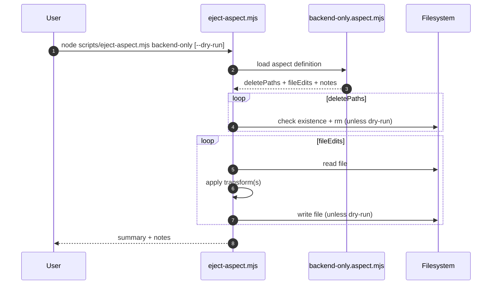

# Eject everything except node-server

## Requirements

- [x] EARS user stories and acceptance criteria captured.
- EARS user stories:
  - When I run `node scripts/eject-aspect.mjs backend-only` (or `npm run eject:backend-only`), the system shall eject the frontend apps (client-website, admin-portal) and related infra/docs, leaving `apps/node-server`, analytics, and `packages/**` intact.
  - When I pass `--dry-run`, the system shall report intended deletes/edits without writing changes.
  - When I run the command without a valid slug, the system shall continue to list available aspects (including `backend-only` after it is added).
- Acceptance criteria:
  - `scripts/aspects/backend-only.aspect.mjs` defines `slug`, `description`, `deletePaths`, `fileEdits`, and `notes`, and is discoverable via `scripts/eject-aspect.mjs`.
  - `package.json` includes `eject:backend-only` and `scripts.md` documents the new aspect.
  - Running `node scripts/eject-aspect.mjs backend-only --dry-run` lists deletions for `apps/client-website` and `apps/admin-portal` plus edits for CDK + docs updates.
  - CDK outputs/stacks for the client website are removed by transforms (stacks, names, outputs index, artifacts/copy script).
  - README/docs no longer reference client website/admin portal after the ejection is applied.
  - Notes mention `npm run eject:analytics` as the optional follow-on to remove analytics.
- Non-goals:
  - Do not remove shared packages (including UI packages) or change workspace globs.
  - Do not change `scripts/eject-aspect.mjs` behavior beyond adding a new aspect file (unless required for overlaps).
  - Do not automatically run the ejection during this change.
- Constraints / Risks:
  - Regex-based transforms are sensitive to upstream file drift; keep transforms resilient and idempotent.
  - Overlapping edits (analytics + client website) require ordered transforms to avoid conflicts.
- Invariants:
  - `apps/node-server` remains untouched.
  - `packages/**` remain intact.
  - Existing `eject:analytics` and `eject:users` flows keep working.
- Interfaces / files / tests to touch:
  - New: `scripts/aspects/backend-only.aspect.mjs`
  - Update: `package.json`, `scripts.md`, `README.md`, `cdk/platform-cdk/README.md`
  - Update: `cdk/platform-cdk/src/stacks.ts`, `cdk/platform-cdk/src/stacks/names.ts`
  - Update: `cdk/platform-cdk/src/consumer/output/index.ts`
  - Update: `cdk/platform-cdk/scripts/copy-lambda-artifacts.ts`
  - Delete: `apps/client-website`, `apps/admin-portal`
  - Delete: `cdk/platform-cdk/src/stacks/client-website-stack`, `cdk/platform-cdk/src/consumer/output/client-website-stack-output.ts`
  - Optional doc touch: `packages/configs/eslint-config/README.md`
- Impacted components / critical paths:
  - Ejection codemod pipeline (`scripts/eject-aspect.mjs` + new aspect definition).
  - CDK stack registry and artifact staging pipeline.
  - Root docs and developer scripts.
- Retrieval sources consulted:
  - `scripts/eject-aspect.mjs`
  - `scripts/aspects/analytics.aspect.mjs`
  - `scripts/aspects/users.aspect.mjs`
  - `scripts/sequences.config.json`
  - `scripts.md`
  - `README.md`
  - `cdk/platform-cdk/README.md`
  - `cdk/platform-cdk/src/stacks.ts`
  - `cdk/platform-cdk/src/stacks/names.ts`
  - `cdk/platform-cdk/src/consumer/output/index.ts`
  - `cdk/platform-cdk/src/lambda/artifacts.ts`
  - `cdk/platform-cdk/scripts/copy-lambda-artifacts.ts`
  - `cdk/platform-cdk/src/consumer/output/client-website-stack-output.ts`
  - `package.json`
  - `packages/configs/eslint-config/README.md`
  - `agents/memory-bank/project.brief.md`
  - `agents/memory-bank/tech.context.md`
  - `agents/memory-bank/best-practices/typescript.md`
  - `agents/memory-bank/best-practices/software-principles.md`
  - `agents/memory-bank/best-practices/testing.md`
- Reflection (Requirements):
  - Scope is clear for a frontend-only ejection; analytics remains optional via the existing aspect.

## Design

- Architecture (logical, data, control flows):
  - Add a `backend-only` aspect definition that removes client/admin resources and updates CDK/docs; analytics removal remains a separate optional aspect.
  - Use deletePaths to remove non-backend app directories and CDK stack/output directories, leaving packages untouched.
  - Update CDK registry (stacks + names + outputs) and artifact staging to remove client website assets.
  - Update docs to remove references to client website/admin portal after ejection.
- Sequence diagram(s):

- Interfaces / contracts:
  - Aspect definition shape: `{ slug, description, deletePaths?, fileEdits?, notes? }`.
  - File edit shape: `{ path, transform }` where `transform` is a function or array of functions returning updated content.
- Edge / failure behaviors:
  - Missing paths are skipped with a logged action.
  - Transform failures throw and abort the run (per `eject-aspect.mjs` behavior).
  - Dry-run should not write files but should still report planned actions.
- Performance / security / migration notes:
  - All operations are local filesystem edits; no network or secrets touched.
  - After applying, `npm install` is recommended to prune removed workspace deps.
- Reflection (Design):
  - Main complexity is ordering multi-step transforms for shared files (stacks, outputs, README).

## Implementation Planning

- Tasks and outcomes:
  - Add `scripts/aspects/backend-only.aspect.mjs`, adding client/admin removal transforms and notes pointing to `eject:analytics` for optional removal.
  - Add new transforms for client website removal in CDK stacks, names, outputs index, copy-lambda-artifacts, and root/docs updates.
  - Update `package.json` and `scripts.md` with `eject:backend-only` instructions.
  - Add doc transform for `packages/configs/eslint-config/README.md` to remove client-website example.
- Dependencies / blockers:
  - Ensure transforms remain stable against current file layouts (regex coverage).
- Test plan mapped to acceptance criteria:
  - AC: aspect definition + discoverability -> `node scripts/eject-aspect.mjs backend-only --help` shows slug.
  - AC: deletePaths + edits -> `node scripts/eject-aspect.mjs backend-only --dry-run` output includes expected paths.
  - AC: docs/stack updates -> spot-check transformed files for removed references.
- Documentation updates:
  - `scripts.md`, `README.md`, `cdk/platform-cdk/README.md`, `packages/configs/eslint-config/README.md`.
- Memory Bank updates:
  - None expected (feature is a new optional ejection aspect; canonicals remain accurate).
- Reflection (Implementation Planning):
  - Ready to implement now that scope is confirmed.

## Decision & Work Log

- 2026-01-01: One-off spec created; user approved frontend-only ejection with optional analytics via existing aspect.

## Execution

- Progress log:
  - Added backend-only aspect definition and wired the new npm script/docs.
  - Verified dry-run output for the new aspect.
- Evidence / tests:
  - `node scripts/eject-aspect.mjs backend-only --dry-run`
- Follow-ups:
  - Apply `npm run eject:backend-only` when ready, then `npm install` to prune deps.
  - Optional: run `npm run eject:analytics` if you want analytics removed too.
- Reflection (Execution):
  - Dry-run confirmed the new aspect edits/deletes without touching analytics.
