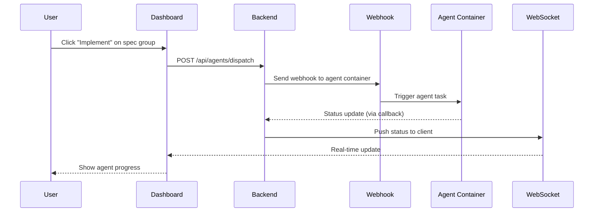

# AI-Native Engineering Dashboard

## Context

Managing AI-native engineering workflows across multiple projects requires constant context-switching between Google Docs (PRDs), GitHub (issues, PRs), and agent execution environments. There is no unified command center to:

- View project status at a glance
- Track spec group lifecycles from draft through merge
- Orchestrate containerized AI agents for development tasks
- Monitor convergence gates before code reaches production

Without this visibility, a solo developer managing multiple projects loses time to manual coordination, misses state transitions, and cannot effectively leverage autonomous agents.

## Goal

Build a self-hosted personal orchestration dashboard that serves as the command center for AI-native engineering, providing:

- Real-time visibility into all projects, PRDs, and spec groups
- Seamless integration with Google Docs as the PRD source of truth
- GitHub integration for issues, PRs, and CI status
- Webhook-based orchestration of containerized AI agents
- Convergence gate tracking to ensure quality before merge

Success means using this dashboard to manage its own development (dogfooding), demonstrating end-to-end project lifecycle management with 5-15 concurrent projects.

## Requirements Summary

See `requirements.md` for full EARS-format requirements.

- REQ-001: Project dashboard overview
- REQ-002: PRD sync from Google Docs
- REQ-003: Spec group lifecycle management
- REQ-004: GitHub issues integration
- REQ-005: GitHub PRs and CI status
- REQ-006: Agent task dispatch via webhooks
- REQ-007: Real-time agent status
- REQ-008: Convergence gate tracking
- REQ-009: Password authentication
- REQ-010: Responsive design
- REQ-011: Health monitoring endpoint
- REQ-012: Structured JSON logging

## Design Overview

### Component Architecture

```
Dashboard UI (Next.js)
    ↓ renders
ProjectList → ProjectCard (status indicators)
    ↓ navigates to
ProjectDetail
    ├── PRDList (sync from Google Docs)
    ├── SpecGroupList (state machine UI)
    ├── GitHubPanel (issues, PRs, CI)
    └── AgentPanel (dispatch, status)

Backend API (Express/Effect)
    ├── /api/projects/* (CRUD)
    ├── /api/prds/* (Google Docs sync)
    ├── /api/spec-groups/* (state machine)
    ├── /api/github/* (proxy)
    ├── /api/agents/* (webhook dispatch)
    └── /api/health (monitoring)

Data Layer (DynamoDB)
    ├── Projects table
    ├── PRDs table
    ├── SpecGroups table
    └── AgentTasks table
```

### Sequence Diagram: Agent Task Dispatch



## Acceptance Criteria

- **AC1.1**: Dashboard displays all projects with status indicators
- **AC1.2**: Project cards show spec group counts and health
- **AC2.1**: Can sync PRD content from Google Docs on demand
- **AC2.2**: PRD version tracked and displayed
- **AC3.1**: Spec groups display current state (DRAFT, APPROVED, etc.)
- **AC3.2**: Valid state transitions enabled, invalid disabled
- **AC4.1**: Linked GitHub issues visible with status
- **AC5.1**: Linked PRs visible with CI status badges
- **AC6.1**: Can dispatch agent tasks via webhooks
- **AC6.2**: Webhook failures handled gracefully
- **AC7.1**: Agent status updates in real-time via WebSocket
- **AC7.2**: Task logs accessible after completion
- **AC8.1**: Convergence gates displayed per spec group
- **AC8.2**: Gate status updates automatically
- **AC9.1**: Password authentication required for access
- **AC9.2**: Session persists across page refreshes
- **AC10.1**: UI usable on mobile devices
- **AC10.2**: Responsive breakpoints at 768px and 1024px
- **AC11.1**: Health endpoint returns system status
- **AC12.1**: All API requests logged as structured JSON

## Non-Goals

- Multi-user or team collaboration features
- AI model training or fine-tuning
- Billing, monetization, or subscription features
- Full OAuth/OIDC implementation
- Kubernetes deployment (Docker Compose only)

## Security Considerations

- Password stored as bcrypt hash
- Session tokens use secure, httpOnly cookies
- Webhooks only accessible within Docker network
- No sensitive data in URL parameters
- Rate limiting on authentication endpoints

## Technical Constraints

- Must use monorepo stack: Next.js, React, TypeScript, DynamoDB
- Agents run in containerized environments (Docker)
- Must integrate with Google Docs API and GitHub API
- Webhooks not publicly exposed (Docker network only)

## Task List

_(Decomposed into atomic specs in `atomic/` directory)_

- [ ] as-001: Project dashboard overview
- [ ] as-002: PRD Google Docs integration
- [ ] as-003: Spec group state machine
- [ ] as-004: GitHub issues integration
- [ ] as-005: GitHub PRs integration
- [ ] as-006: Agent webhook dispatch
- [ ] as-007: Real-time agent status
- [ ] as-008: Convergence gate display
- [ ] as-009: Password authentication
- [ ] as-010: Responsive design
- [ ] as-011: Health monitoring endpoint
- [ ] as-012: Structured JSON logging

## Decision Log

- `2026-01-17T20:50:00Z`: Spec authored from PRD
- `2026-01-17T20:50:00Z`: Decomposed into 12 atomic specs
