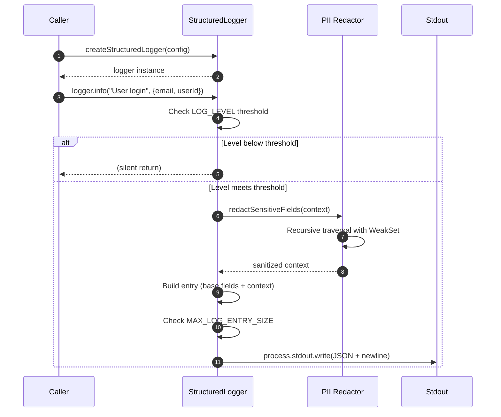
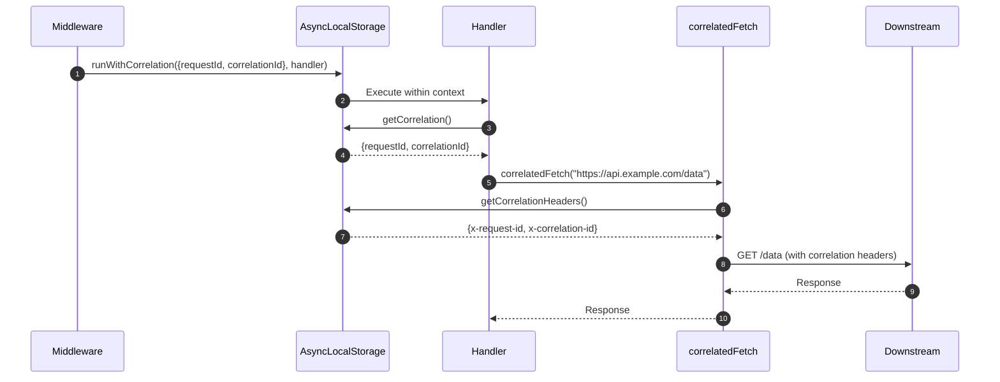
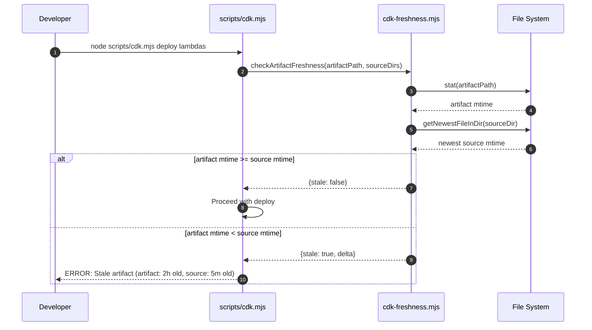

# Cross-Repo Infrastructure Improvements

## Context

The ai-eng-dashboard repository has developed and battle-tested several infrastructure improvements that are missing from this monorepo. Analysis of the ai-eng-dashboard commit history identified 4 high-value improvements worth porting:

1. **Structured JSON Logger with PII Redaction** (commits `87ba94d`, `0233149`) -- The monorepo's `LoggerService` at `packages/core/backend-core/src/services/logger.ts` is a 20-line Effect-TS tag with `log`, `logError`, `logDebug`. No structured output, no PII protection, no level filtering.

2. **Correlation Context via AsyncLocalStorage** (commit `9fbc6a5`) -- The monorepo's three apps (`node-server`, `analytics-lambda`, `admin-portal`) have no cross-service request tracing.

3. **Stale Artifact Detection for Deploys** (commits `9491671`, `387c923`) -- The monorepo's `scripts/cdk.mjs` has no freshness check. You can deploy with a day-old `lambda.zip` after source changes.

4. **Selective .claude/ Copy for Worktrees** -- The monorepo's `manage-worktrees.mjs` creates git worktrees but does not handle `.claude/` directory isolation.

Each improvement has a proven reference implementation in ai-eng-dashboard.

## Goals / Non-goals

- Goals:
  - Port each improvement as an independent, atomic unit of work
  - Maintain backward compatibility with all existing callers
  - Add zero new external dependencies
  - Each spec is independently testable, deployable, and reversible

- Non-goals:
  - Replacing the Effect-TS architecture
  - Adding OpenTelemetry or distributed tracing SDKs
  - Changing the CDKTF deployment toolchain
  - Modifying git worktree creation logic beyond `.claude/` handling

## Requirements

See `requirements.md` for full EARS-format requirements.

| ID       | Title                                      | Priority    |
| -------- | ------------------------------------------ | ----------- |
| REQ-001  | Structured logger factory                  | Must Have   |
| REQ-002  | PII redaction in log context               | Must Have   |
| REQ-003  | LOG_LEVEL environment variable filtering   | Must Have   |
| REQ-004  | Log entry size truncation                  | Must Have   |
| REQ-005  | Circular reference protection              | Must Have   |
| REQ-006  | Base field override protection             | Must Have   |
| REQ-007  | LoggerService backward compatibility       | Must Have   |
| REQ-008  | AsyncLocalStorage correlation context      | Must Have   |
| REQ-009  | getCorrelation() with graceful degradation | Must Have   |
| REQ-010  | Correlation headers generation             | Must Have   |
| REQ-011  | correlatedFetch wrapper                    | Must Have   |
| REQ-012  | Correlation ID validation                  | Must Have   |
| REQ-013  | Zero external dependencies (correlation)   | Must Have   |
| REQ-014  | getNewestFileInDir with symlink protection | Must Have   |
| REQ-015  | checkArtifactFreshness comparator          | Must Have   |
| REQ-016  | Deploy command freshness gate              | Must Have   |
| REQ-017  | --acknowledge-stale flag behavior          | Must Have   |
| REQ-018  | ARTIFACT_SOURCE_DIRS monorepo mappings     | Must Have   |
| REQ-019  | Selective .claude/ operational copy        | Should Have |
| REQ-020  | State directory exclusion                  | Should Have |
| REQ-021  | extractSpecGroupId from branch name        | Should Have |
| REQ-022  | Worktree Claude Code functionality         | Should Have |

## Core Flows

### Flow 1: Structured Logging with PII Redaction

1. Service calls `createStructuredLogger({ service: 'node-server', component: 'auth' })`
2. Logger instance returned with `info`, `warn`, `error`, `debug` methods
3. Caller invokes `logger.info('User login', { userId: '123', email: 'user@example.com' })`
4. Logger checks `LOG_LEVEL` -- if below threshold, silently returns
5. Logger recursively redacts sensitive fields (`email` becomes `[REDACTED]`)
6. Logger serializes to JSON, checks size against 8KB limit
7. Logger writes single-line JSON to `process.stdout`

### Flow 2: Correlation Context Propagation

1. Express middleware calls `runWithCorrelation({ requestId, correlationId }, handler)`
2. Handler and all async descendants access context via `getCorrelation()`
3. When making outbound HTTP calls, code uses `correlatedFetch(url)` which auto-injects headers
4. Downstream service receives `x-request-id` and `x-correlation-id` headers

### Flow 3: Stale Artifact Detection During Deploy

1. Developer runs `node scripts/cdk.mjs deploy lambdas`
2. Before deploying, script calls `checkArtifactFreshness()` for each required artifact
3. Utility finds newest source file mtime across mapped source directories
4. If artifact mtime < source mtime, deploy is blocked with clear error
5. Developer either rebuilds or passes `--acknowledge-stale` to explicitly bypass

### Flow 4: Selective .claude/ Copy for Worktrees

1. `manage-worktrees.mjs ensure` creates a worktree
2. After worktree creation, calls `selectiveCopyClaudeDir(sourceDir, targetDir)`
3. Only operational items are copied (skills, agents, templates, scripts, schemas, settings)
4. State directories (specs/groups, context, memory-bank) are excluded
5. Claude Code in worktree has full operational capability without state pollution

## Sequence Diagram(s)







## Edge Cases

- **Logger: Circular references** -- WeakSet detects cycles and emits fallback entry with `_serialization_error: true`
- **Logger: Non-string message** -- Coerced via `String(message)` before inclusion
- **Logger: Invalid LOG_LEVEL** -- Warning to stderr, defaults to INFO
- **Correlation: Outside ALS context** -- `getCorrelation()` returns `undefined`, `getCorrelationHeaders()` returns `{}`, `correlatedFetch` behaves like native fetch
- **Correlation: Invalid ID format** -- Rejected at ingest boundary, request proceeds without correlation
- **Freshness: Missing artifact** -- Treated as stale (artifact does not exist)
- **Freshness: Missing source directory** -- `getNewestFileInDir` returns null, skip that source dir
- **Freshness: Symlink loops** -- `visited` Set prevents infinite recursion via `realpathSync`
- **Selective copy: Missing source items** -- Skipped gracefully, logged as skipped
- **Selective copy: Existing target items** -- Overwritten (copy is idempotent)

## Interfaces & Data Model

### AS-001: Structured Logger

```typescript
// packages/core/backend-core/src/services/structured-logger.ts
type LogLevel = 'DEBUG' | 'INFO' | 'WARN' | 'ERROR';
type LogContext = Record<string, unknown>;
type StructuredLoggerConfig = {
  service: string;
  component: string;
  env?: string;
  version?: string;
};
type StructuredLogger = {
  readonly info: (message: string, context?: LogContext) => void;
  readonly warn: (message: string, context?: LogContext) => void;
  readonly error: (message: string, context?: LogContext) => void;
  readonly debug: (message: string, context?: LogContext) => void;
};
function createStructuredLogger(config: StructuredLoggerConfig): StructuredLogger;
function parseLogLevel(raw?: string): LogLevel;

// Updated LoggerService interface
type LoggerServiceSchema = {
  readonly log: (...input: ReadonlyArray<unknown>) => Effect.Effect<void, never>;
  readonly logError: (...input: ReadonlyArray<unknown>) => Effect.Effect<void, never>;
  readonly logDebug: (...input: ReadonlyArray<unknown>) => Effect.Effect<void, never>;
  readonly logWarn: (...input: ReadonlyArray<unknown>) => Effect.Effect<void, never>;
};
```

### AS-002: Correlation Context

```typescript
// packages/core/backend-core/src/services/correlation-context.ts
interface CorrelationStore {
  requestId?: string;
  correlationId?: string;
  jobId?: string;
  workflowId?: string;
}
function runWithCorrelation<T>(store: CorrelationStore, fn: () => T): T;
function getCorrelation(): CorrelationStore | undefined;
function getCorrelationHeaders(): Record<string, string>;

// packages/core/backend-core/src/services/correlated-fetch.ts
function correlatedFetch(input: string | URL | Request, init?: RequestInit): Promise<Response>;
```

### AS-003: CDK Freshness

```javascript
// scripts/utils/cdk-freshness.mjs
export const getNewestFileInDir = (dirPath) => { path, mtime } | null;
export const formatTimeDelta = (deltaMs) => string;
export const formatTimestamp = (date) => string;
// NEW function to be created in cdk-freshness.mjs (not porting an existing export)
export const checkArtifactFreshness = (artifactPath, sourceDirs, thresholdMs?) => {
  stale: boolean, artifactMtime: Date|null, newestSourceMtime: Date|null, delta: number, newestSourcePath: string|null
};
export const ARTIFACT_SOURCE_DIRS = Record<string, string[]>;
```

### AS-004: Selective Claude Copy

```javascript
// .claude/scripts/selective-claude-copy.mjs
export const CLAUDE_INCLUDE_LIST = string[];
export function selectiveCopyClaudeDir(sourceDir, targetDir) => { copied, skipped };
export function extractSpecGroupId(branchName) => string | null;
export function cleanupExcludedDirs(claudeDir) => string[];
```

## Security

- **PII Redaction (AS-001)**: The `SENSITIVE_KEYS` set is a shared constant at `packages/core/backend-core/src/constants/sensitive-keys.ts` containing 22+ field names, imported by both the structured logger and the existing logging middleware. Redaction is recursive and operates before JSON serialization. Base fields (`timestamp`, `level`, `service`, `component`) cannot be overridden by caller context to prevent log injection.
- **Log Output (AS-001)**: Uses `process.stdout.write` instead of `console.log` to avoid recursive logging hooks. Max entry size of 8KB prevents unbounded writes.
- **Correlation ID Validation (AS-002)**: IDs are validated at ingest boundaries using regex `^[a-zA-Z0-9._-]{1,128}$` to prevent injection via correlation headers.
- **No Sensitive Data in Headers (AS-002)**: Only `requestId` and `correlationId` are propagated -- never `jobId` or `workflowId`.
- **Deploy Safety (AS-003)**: `--force` intentionally does NOT bypass freshness checks -- only `--acknowledge-stale` does. This prevents accidental stale deploys even when forcing past other validation.
- **Worktree Isolation (AS-004)**: State directories excluded from worktree copies to prevent spec/context/journal leakage across parallel workstreams.

## Additional Considerations

- Follow TypeScript best practices per `.claude/memory-bank/best-practices/typescript.md`
- Follow code quality standards per `.claude/memory-bank/best-practices/code-quality.md`
- AS-001 and AS-002 have a soft dependency: the structured logger can auto-enrich with correlation IDs if the correlation context module exists, but each works independently. AS-001 MUST use a conditional/optional import pattern so it does not fail if AS-002 is not yet implemented (no hard import of correlation-context).
- AS-003 integrates into the existing `scripts/cdk.mjs` which is ESM JavaScript (not TypeScript)
- AS-004 integrates into the existing `.claude/scripts/manage-worktrees.mjs`

## Task List

See atomic specs `as-001.md` through `as-004.md` for detailed task breakdowns per workstream.

High-level task summary:

- [ ] AS-001: Create `structured-logger.ts` with factory, PII redaction, level filtering, size truncation (REQ-001 through REQ-006)
- [ ] AS-001: Extend `LoggerService` interface with `logWarn` (REQ-007)
- [ ] AS-002: Create `correlation-context.ts` with ALS context management (REQ-008 through REQ-010, REQ-012, REQ-013)
- [ ] AS-002: Create `correlated-fetch.ts` with header injection (REQ-011)
- [ ] AS-003: Create `scripts/utils/cdk-freshness.mjs` utility (REQ-014, REQ-015)
- [ ] AS-003: Integrate freshness gate into `scripts/cdk.mjs` deploy command (REQ-016 through REQ-018)
- [ ] AS-004: Create `.claude/scripts/selective-claude-copy.mjs` (REQ-019 through REQ-021)
- [ ] AS-004: Integrate selective copy into `manage-worktrees.mjs` (REQ-022)

## Testing

### Unit Tests
- AS-001: `packages/core/backend-core/src/__tests__/services/structured-logger.test.ts` -- factory output, PII redaction, level filtering, truncation, circular references
- AS-002: `packages/core/backend-core/src/__tests__/services/correlation-context.test.ts` -- ALS context, headers, graceful degradation
- AS-002: `packages/core/backend-core/src/__tests__/services/correlated-fetch.test.ts` -- header injection, caller override, outside context
- AS-003: `scripts/__tests__/cdk-freshness.test.mjs` -- getNewestFileInDir, symlink loops, freshness comparison, time formatting
- AS-004: `.claude/scripts/__tests__/selective-claude-copy.test.mjs` -- include/exclude lists, extractSpecGroupId, cleanup

### Integration Tests
- AS-003: Test freshness gate in `scripts/cdk.mjs` with mock artifacts
- AS-004: Test worktree creation with selective copy end-to-end

### Test Mapping
| AC       | Test File                                  | Test Description                     |
| -------- | ------------------------------------------ | ------------------------------------ |
| AC1.1-7, AC2.1-8  | structured-logger.test.ts                  | Factory, output format, PII redaction, logWarn, fake, shared keys, correlation degradation |
| AC2.1-7  | correlation-context.test.ts                | ALS context, headers, degradation    |
| AC2.8-11 | correlated-fetch.test.ts                   | Fetch wrapper, header injection      |
| AC3.1-8  | cdk-freshness.test.mjs                     | Freshness utility, deploy gate       |
| AC4.1-5  | selective-claude-copy.test.mjs             | Selective copy, spec group extraction |

## Open Questions

- Q1: Should the structured logger be wired as the default Effect-TS `LoggerService` implementation, or exist as a standalone utility? (Status: open, Priority: medium, Recommendation: standalone with adapter pattern)
- Q2: Should AS-002 include Express middleware for correlation context, or just export primitives? (Status: open, Priority: low, Recommendation: primitives only, middleware in follow-up)

## Workstream Reflection

(To be filled during/after implementation)

## Decision & Work Log

- 2026-02-20: Spec group created from analysis of ai-eng-dashboard commit history
- 2026-02-20: Decision -- Each improvement is an independent atomic spec (AS-001 through AS-004) that can be implemented and deployed independently
- 2026-02-20: Decision -- AS-001 and AS-002 have soft dependency (logger can enrich with correlation IDs) but are independently functional
- 2026-02-20: Decision -- `--force` does NOT bypass freshness in AS-003 (only `--acknowledge-stale` does) per ai-eng-dashboard design intent
- 2026-02-20: Decision -- AS-004 uses include-list approach (copy only named items) rather than exclude-list (copy everything except named items) for security-by-default
- 2026-02-23: Fix INC-001 -- `checkArtifactFreshness` is a NEW function to create in cdk-freshness.mjs (not porting existing export). Canonical signature returns `{ stale, artifactMtime, newestSourceMtime, delta, newestSourcePath }`
- 2026-02-23: Fix INC-002 -- Extract shared `SENSITIVE_KEYS` constant to `packages/core/backend-core/src/constants/sensitive-keys.ts`; both structured logger and logging middleware import from it
- 2026-02-23: Fix INC-003 -- AS-001 uses conditional/optional import for correlation-context (AS-002); logger degrades gracefully if AS-002 not available
- 2026-02-23: Fix INC-004 -- AS-001 task list includes updating test fake at `testing/fakes/logger.ts` with `logWarn`
- 2026-02-23: Fix INC-006 -- `ARTIFACT_SOURCE_DIRS` uses plain object `Record<string, string[]>` (not Map)
- 2026-02-23: Fix INC-007 -- Fixed `journals` to `journal` (singular) matching CLAUDE.md convention
- 2026-02-23: Fix INC-009 -- Fixed `parent_spec` in all atomic specs from `ws-` to `sg-` prefix
