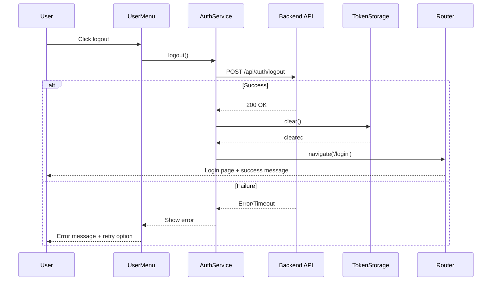

# Logout Feature for Dashboard

## Context

Users currently have no way to log out of the dashboard application. They must manually clear browser cookies and local storage, which is poor UX and a security concern.

## Goal

Provide a clear, accessible logout mechanism that securely terminates the user session and returns them to a known state.

## Requirements Summary

See `requirements.md` for full EARS-format requirements.

- REQ-001: User-initiated logout via UI
- REQ-002: Complete token clearing
- REQ-003: Post-logout navigation
- REQ-004: Graceful error handling

## Design Overview

### Component Architecture

```
UserMenu (UI)
    ↓ click
LogoutButton
    ↓ triggers
AuthService.logout()
    ↓ calls
API: POST /api/auth/logout
    ↓ on success
TokenStorage.clear()
    ↓ then
Router.navigate('/login')
```

### Sequence Diagram



## Acceptance Criteria

- **AC1.1**: Logout button visible in user menu when authenticated
- **AC1.2**: Logout button click initiates logout process
- **AC2.1**: Local storage auth tokens cleared on logout
- **AC2.2**: Auth cookies cleared on logout
- **AC2.3**: Server session invalidated
- **AC3.1**: User redirected to /login after successful logout
- **AC3.2**: Success message displayed on login page
- **AC4.1**: Error message shown on logout failure
- **AC4.2**: User remains logged in on failure
- **AC4.3**: Retry option available on failure

## Non-Goals

- Single sign-out across multiple applications
- Automatic session timeout (separate feature)
- "Remember me" functionality changes

## Security Considerations

- Token clearing must be synchronous before redirect
- Server invalidation should happen even if client clears tokens
- No sensitive data in URL parameters during redirect

## Task List

_(Decomposed into atomic specs in `atomic/` directory)_

- [ ] as-001: Implement logout button UI
- [ ] as-002: Implement token clearing
- [ ] as-003: Implement post-logout redirect
- [ ] as-004: Implement error handling

## Decision Log

- `2026-01-14T10:00:00Z`: Spec authored from requirements
- `2026-01-14T10:30:00Z`: Decomposed into 4 atomic specs
