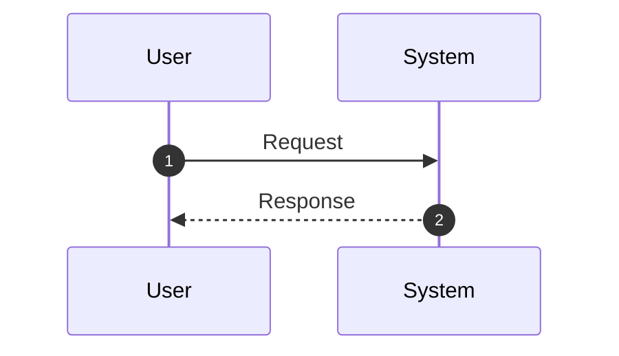

# <Task Title>

## Context
Brief background and motivation for this task.

## Goal
Clear statement of what success looks like.

## Requirements (EARS Format)
- **WHEN** <trigger condition>
- **THEN** the system shall <required behavior>
- **AND** <additional required behavior>

## Acceptance Criteria
- AC1.1: <Testable criterion that can be verified>
- AC1.2: <Testable criterion that can be verified>
- AC2.1: <Testable criterion that can be verified>

## Design Notes
Brief architecture notes, key design decisions, or approach.

Optional sequence diagram for non-trivial flows:

## Task List
- [ ] Task 1: <Concrete outcome with clear completion criteria>
- [ ] Task 2: <Concrete outcome with clear completion criteria>
- [ ] Task 3: <Concrete outcome with clear completion criteria>

## Test Plan
Map each acceptance criterion to specific test cases:

- AC1.1 → `__tests__/<file>.test.ts`: "should <behavior>"
- AC1.2 → `__tests__/<file>.test.ts`: "should <behavior>"
- AC2.1 → `__tests__/<file>.test.ts`: "should <behavior>"

## Decision & Work Log
- <YYYY-MM-DD>: <Decision or approval recorded here>
- <YYYY-MM-DD>: Work started
- <YYYY-MM-DD>: Implementation complete
