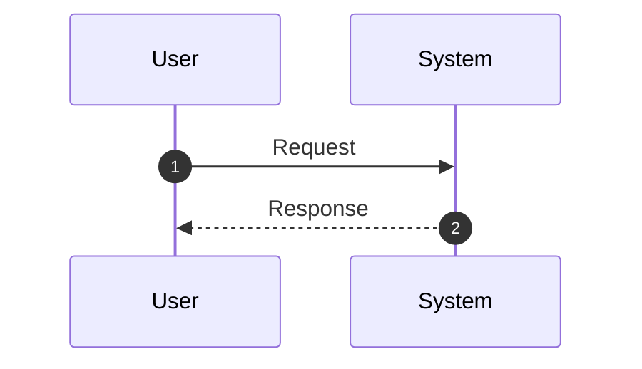

# <Task Title>

## Context

Brief background and motivation for this task.

## Goal

Clear statement of what success looks like.

## Requirements (EARS Format)

- **WHEN** <trigger condition>
- **THEN** the system shall <required behavior>
- **AND** <additional required behavior>

## Acceptance Criteria

- AC1.1: <Testable criterion that can be verified>
- AC1.2: <Testable criterion that can be verified>
- AC2.1: <Testable criterion that can be verified>

## Design Notes

Brief architecture notes, key design decisions, or approach.

Optional sequence diagram for non-trivial flows:


```mermaid
sequenceDiagram
  autonumber
  participant User
  participant System
  User->>System: Request
  System-->>User: Response
```

## Interfaces & Contracts

<!-- Optional section. Write "N/A -- no boundary crossings" if this spec does not cross service,
     runtime, or process boundaries. When present, define contracts using fenced yaml:contract blocks
     referencing templates from .claude/contracts/templates/. See naming conventions at
     .claude/contracts/naming-conventions.md. -->

### REST API Contracts

<!-- prettier-ignore -->
```yaml:contract
_template: rest-api
method: <HTTP method>
path: <endpoint path>
content_type: application/json
request_shape: <request body fields and types>
response_shape: <response body fields and types>
error_codes: <status codes and meanings>
auth_method: <none | api-key | bearer-token | cookie-session | oauth2>
auth_scope: <required scope or "public">
required_headers: <list of required headers>
rate_limit_tier: <none | standard | strict>
error_sanitization: <full | safe-message-only | opaque>
```

### Event Contracts

<!-- prettier-ignore -->
```yaml:contract
_template: event
event_name: <resource.action>
channel: <channel or topic path>
payload_shape: <payload fields and types>
auth_method: <none | api-key | bearer-token | cookie-session>
channel_access_control: <public | authenticated | role-based | owner-only>
```

### Data Model Contracts

<!-- prettier-ignore -->
```yaml:contract
_template: data-model
entity_name: <EntityName>
fields: <field definitions with types>
relationships: <relationships to other entities>
indexes: <database indexes>
data_classification: <public | internal | confidential | restricted>
pii_fields: <list of PII field names>
```

### Behavioral Contracts

<!-- prettier-ignore -->
```yaml:contract
_template: behavioral
behavior_name: <behavior-name>
retry_policy: <retry configuration>
timeout: <timeout configuration>
ordering_guarantee: <none | per-key | per-user | global>
concurrency: <concurrency model>
idempotency: <none | client-token | natural-key>
rate_limit_tier: <none | standard | strict>
```

## Security Considerations

<!-- Optional section. Include when the spec involves authentication, authorization,
     data handling, or external boundaries. -->

### Authentication & Authorization

- Auth method: <method used>
- Scopes required: <list of scopes>
- Token handling: <how tokens are managed>

### Data Protection

- Data classification: <public | internal | confidential | restricted>
- PII handling: <how PII is protected>
- Encryption: <at-rest and in-transit requirements>

### Input Validation

- Boundary validation: <Zod schemas, input sanitization>
- Error sanitization: <how errors are sanitized for external consumers>

## Task List

- [ ] Task 1: <Concrete outcome with clear completion criteria>
- [ ] Task 2: <Concrete outcome with clear completion criteria>
- [ ] Task 3: <Concrete outcome with clear completion criteria>

## Test Plan

Map each acceptance criterion to specific test cases:

- AC1.1 → `__tests__/<file>.test.ts`: "should <behavior>"
- AC1.2 → `__tests__/<file>.test.ts`: "should <behavior>"
- AC2.1 → `__tests__/<file>.test.ts`: "should <behavior>"

## Decision & Work Log

- <YYYY-MM-DD>: <Decision or approval recorded here>
- <YYYY-MM-DD>: Work started
- <YYYY-MM-DD>: Implementation complete
