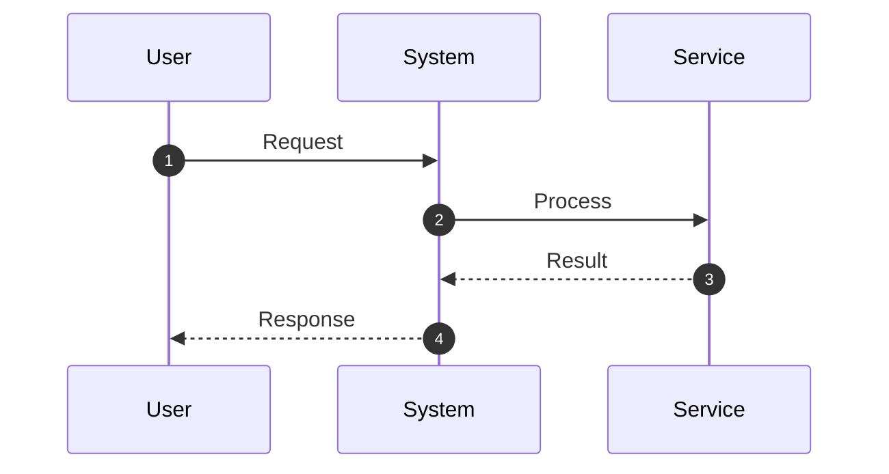

# <Workstream Title>

## Context

Background and motivation for this workstream.

## Goals / Non-goals

- Goals:
  - ...
- Non-goals:
  - ...

## Requirements

List atomic, testable requirements (EARS format preferred):

- **WHEN** <condition>, **THEN** the system shall <behavior>
- ...

## Core Flows

Primary user flows and system behaviors:

- Flow 1: ...
- Flow 2: ...

## Sequence Diagram(s)

## Edge Cases

- Edge case 1: ...
- Edge case 2: ...

## Interfaces & Data Model

Define contracts, APIs, and data structures:

- Interface 1: ...
- Data model: ...

## Security

Security considerations and requirements:

- Input validation: ...
- Authentication/Authorization: ...
- Data protection: ...

## Additional Considerations

- Best-practices references: ...
- Documentation updates: ...

## Task List

Translate requirements and design into discrete tasks:

- [ ] Task 1: <outcome> (depends on: none)
- [ ] Task 2: <outcome> (depends on: Task 1)
- [ ] Task 3: <outcome> (depends on: Task 1)

## Testing

Testing strategy and coverage:

- Unit tests: ...
- Integration tests: ...
- Test mapping to requirements: ...

## Open Questions

- Q1: <Question>? (Status: open/deferred/resolved)
- Q2: <Question>? (Status: open/deferred/resolved)

## Workstream Reflection

Capture problems encountered and preventable errors:

- Issue: ...
- Root cause: ...
- Prevention: ...

## Decision & Work Log

- <YYYY-MM-DD>: Decision - <What was decided and why>
- <YYYY-MM-DD>: Approval - <Who approved and any conditions>
- <YYYY-MM-DD>: Work Log - <Key milestones and progress>
