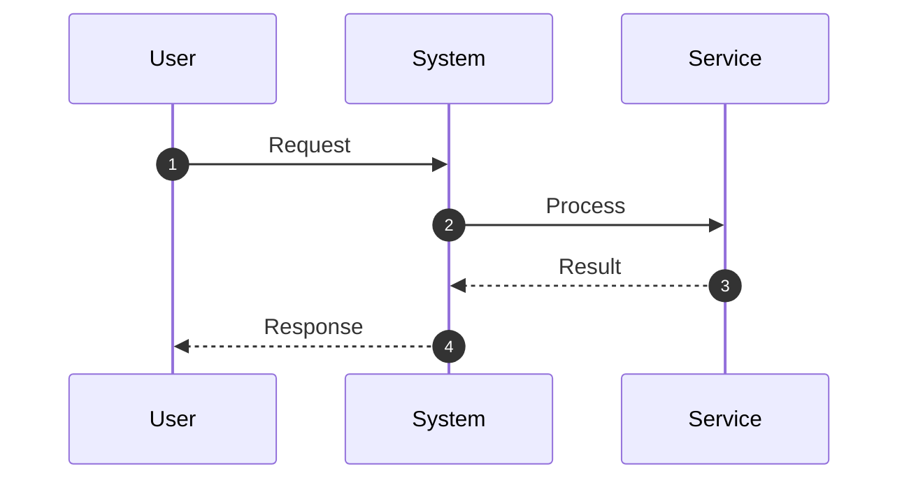

# <Workstream Title>

## Context

Background and motivation for this workstream.

## Goals / Non-goals

- Goals:
  - ...
- Non-goals:
  - ...

## Requirements

List atomic, testable requirements (EARS format preferred):

- **WHEN** <condition>, **THEN** the system shall <behavior>
- ...

## Core Flows

Primary user flows and system behaviors:

- Flow 1: ...
- Flow 2: ...

## Sequence Diagram(s)


```mermaid
sequenceDiagram
  autonumber
  participant User
  participant System
  participant Service
  User->>System: Request
  System->>Service: Process
  Service-->>System: Result
  System-->>User: Response
```

## Edge Cases

- Edge case 1: ...
- Edge case 2: ...

## Interfaces & Contracts

<!-- Optional section. Write "N/A -- no boundary crossings" if this spec does not cross service,
     runtime, or process boundaries. When present, define contracts using fenced yaml:contract blocks
     referencing templates from .claude/contracts/templates/. See naming conventions at
     .claude/contracts/naming-conventions.md. -->

### REST API Contracts

<!-- prettier-ignore -->
```yaml:contract
_template: rest-api
method: <HTTP method>
path: <endpoint path>
content_type: application/json
request_shape: <request body fields and types>
response_shape: <response body fields and types>
error_codes: <status codes and meanings>
auth_method: <none | api-key | bearer-token | cookie-session | oauth2>
auth_scope: <required scope or "public">
required_headers: <list of required headers>
rate_limit_tier: <none | standard | strict>
error_sanitization: <full | safe-message-only | opaque>
```

### Event Contracts

<!-- prettier-ignore -->
```yaml:contract
_template: event
event_name: <resource.action>
channel: <channel or topic path>
payload_shape: <payload fields and types>
auth_method: <none | api-key | bearer-token | cookie-session>
channel_access_control: <public | authenticated | role-based | owner-only>
```

### Data Model Contracts

<!-- prettier-ignore -->
```yaml:contract
_template: data-model
entity_name: <EntityName>
fields: <field definitions with types>
relationships: <relationships to other entities>
indexes: <database indexes>
data_classification: <public | internal | confidential | restricted>
pii_fields: <list of PII field names>
```

### Behavioral Contracts

<!-- prettier-ignore -->
```yaml:contract
_template: behavioral
behavior_name: <behavior-name>
retry_policy: <retry configuration>
timeout: <timeout configuration>
ordering_guarantee: <none | per-key | per-user | global>
concurrency: <concurrency model>
idempotency: <none | client-token | natural-key>
rate_limit_tier: <none | standard | strict>
```

## Security Considerations

<!-- Optional section. Include when the spec involves authentication, authorization,
     data handling, or external boundaries. -->

### Authentication & Authorization

- Auth method: <method used>
- Scopes required: <list of scopes>
- Token handling: <how tokens are managed>

### Data Protection

- Data classification: <public | internal | confidential | restricted>
- PII handling: <how PII is protected>
- Encryption: <at-rest and in-transit requirements>

### Input Validation

- Boundary validation: <Zod schemas, input sanitization>
- Error sanitization: <how errors are sanitized for external consumers>

## Additional Considerations

- Best-practices references: ...
- Documentation updates: ...

## Task List

Translate requirements and design into discrete tasks:

- [ ] Task 1: <outcome> (depends on: none)
- [ ] Task 2: <outcome> (depends on: Task 1)
- [ ] Task 3: <outcome> (depends on: Task 1)

## Testing

Testing strategy and coverage:

- Unit tests: ...
- Integration tests: ...
- Test mapping to requirements: ...

## Open Questions

- Q1: <Question>? (Status: open/deferred/resolved)
- Q2: <Question>? (Status: open/deferred/resolved)

## Workstream Reflection

Capture problems encountered and preventable errors:

- Issue: ...
- Root cause: ...
- Prevention: ...

## Decision & Work Log

- <YYYY-MM-DD>: Decision - <What was decided and why>
- <YYYY-MM-DD>: Approval - <Who approved and any conditions>
- <YYYY-MM-DD>: Work Log - <Key milestones and progress>
