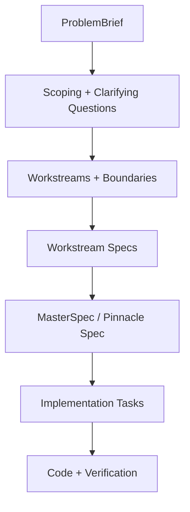
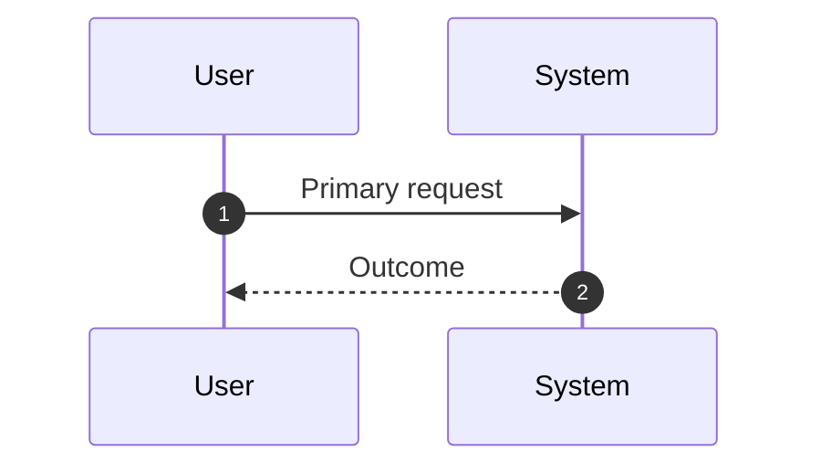

# Spec-First Orchestration System (Pinnacle Spec)

## Intent

Define a spec-first orchestration model that turns high-level requests into parallelized workstream specs, merges them into a coherent MasterSpec (the "pinnacle spec"), and only then authorizes implementation.

## Goals

- Add a formal Spec Factory pipeline from ProblemBrief to Implementation Tasks.
- Define actor modes and their responsibilities, including user-directed selection and one-off variants.
- Establish a shared spec schema and contract registry for machine-checkable artifacts.
- Introduce automated review gates that must pass before codegen/implementation.
- Describe a convergence loop that iterates until specs are complete and consistent.

## Non-goals

- Implement production-ready scripts, workflows, or orchestration runtime in this change.
- Replace the existing per-task spec system; this design layers on top of it.
- Dictate product requirements beyond the orchestration system itself.

## Actor Modes

- Orchestrator: owns ProblemBrief normalization, workstream decomposition, spec merge, conflict resolution, and go/no-go gating.
- Spec Author (Subagent): produces a workstream spec and required contracts; does not implement code.
- Implementer: turns approved specs into code/tests and verifies acceptance criteria.
- One-off Vibe: ships a small change without specs; uses only the system context and keeps scope tight.
- One-off Spec: uses a single spec (one-off spec workflow) and implements after approval; approvals are logged in Decision & Work Log.

## Mode Selection (User-Directed)

- The user chooses the mode (orchestrator vs one-off).
- If the user chooses one-off, ask whether they want One-off Vibe or One-off Spec.
- If assigned to a specific workstream, operate as a spec author and deliver a compliant spec (no code).
- If assigned to execute an approved spec, operate as an implementer and reference the MasterSpec.

## Pinnacle Spec

The pinnacle spec is the MasterSpec produced in orchestrator mode. It is required whenever the user selects orchestrator mode (no quantitative threshold).

Recommended signals for choosing orchestrator mode:

- Multiple workstreams are needed.
- Cross-cutting contracts/interfaces are introduced or changed.
- The change impacts multiple repositories, services, or architectural layers.

The pinnacle spec must include:

- ProblemBrief summary, goals, non-goals, and constraints.
- Workstream list with owners, dependencies, and deliverables.
- Interface and contract registry references.
- Acceptance criteria and review gates.

## Spec Factory Pipeline



### Pipeline Outputs

- ProblemBrief: normalized request, constraints, success criteria.
- Workstreams: parallelizable units with explicit boundaries.
- Workstream Specs: schema-compliant, contract-referenced specifications.
- MasterSpec: merged view with conflict resolution and global gates.
- Implementation Tasks: sequenced task list tied to acceptance criteria.

Notes:

- One-off Spec collapses the pipeline into a single spec and a single task list.
- One-off Vibe bypasses the pipeline entirely.

## Decomposition Method

1. In orchestrator mode, normalize the request into a ProblemBrief with constraints, invariants, and success criteria.
2. Identify domains and interfaces (API, data, security, reliability, UX, QA).
3. Define workstreams around bounded contracts and ownership.
4. Build a dependency graph and mark parallelizable vs sequential workstreams.
5. Assign spec authors with scoped responsibilities and expected outputs.

Heuristics:

- Workstreams should own a contract or interface surface.
- Shared dependencies must be captured in the contract registry.
- Avoid splitting by team alone; split by interface and responsibility boundaries.

## Shared Spec Schema

Each spec is human-readable but machine-checkable. Use YAML front matter plus a JSON Schema for validation.

### ProblemBrief (YAML)

```yaml
id: brief-001
title: Build X
summary: One-paragraph canonical request.
goals:
  - ...
non_goals:
  - ...
constraints:
  - ...
success_criteria:
  - ...
open_questions:
  - ...
```

### WorkstreamSpec (YAML)

```yaml
id: ws-api
title: API Workstream
owner: spec-author-api
scope: API surface and request/response contracts.
status: draft
implementation_status: not_started
dependencies:
  - ws-data
contracts:
  - id: contract-api-v1
```

### Workstream Spec Structure (Required Sections)

- Context
- Goals / Non-goals
- Requirements (atomic, testable, unambiguous)
- Core Flows
- Sequence Diagram(s) (Mermaid for primary flows)
- Edge Cases
- Interfaces & Data Model
- Security (if applicable)
- Additional considerations
- Task List (derived from Requirements and Design)
- Testing
- Open Questions
- Decision & Work Log (required for multi-session specs; record user approvals here)

Example sequence diagram (align with `agents/memory-bank/task-spec.guide.md`):



One-off Spec uses the same section structure, even when there is only a single spec.

### MasterSpec (YAML)

```yaml
id: master-001
title: Pinnacle Spec for Build X
workstreams:
  - ws-api
  - ws-data
contracts:
  - contract-api-v1
gates:
  - spec_complete
```

## Contract Registry

Machine-checkable artifacts live under `<agents/contracts/>` and are indexed in a registry.

Example registry entry:

```yaml
- id: contract-api-v1
  type: openapi
  path: agents/contracts/api/openapi.yaml
  owner: ws-api
  version: 1
```

## Cross-Spec Interface Contracts

- Workstream specs reference contracts by id.
- The MasterSpec validates that each contract has one owner and no conflicting definitions.
- Contract changes require a version bump and explicit migration notes.

## Review Gates (Spec-Complete)

Spec-complete means:

- All required workstreams exist and are schema-valid.
- Each workstream includes the required sections and atomic/testable requirements.
- Contract registry is complete, unique, and machine-validated.
- Dependency graph is acyclic and conflicts are resolved.
- Open questions are closed or explicitly deferred with owner/date.
- User approvals are recorded in the Decision & Work Log.

## Convergence Loop

1. Orchestrator requests workstream specs.
2. Subagents deliver drafts; orchestrator runs validation and merge checks.
3. Conflicts or gaps trigger a targeted iteration.
4. When all gates pass, the MasterSpec is marked spec-complete and approvals are recorded.
5. Only then can implementation tasks be assigned.

Guardrails:

- Cap iterations (e.g., max 3) before requiring user decision.
- Block implementation if any contract is missing or invalid.

## Workflow Integration

Proposed workflow additions:

- `<agents/workflows/orchestrator.workflow.md>` for multi-workstream orchestration.
- `<agents/workflows/spec-author.workflow.md>` for subagent spec creation.
- `<agents/workflows/implementer.workflow.md>` for spec-driven execution.
- `<agents/workflows/oneoff.workflow.md>` for one-off routing and overview.
- `<agents/workflows/oneoff-spec.workflow.md>` for one-off spec tasks.
- `<agents/workflows/oneoff-vibe.workflow.md>` for one-off vibe tasks.

One-off spec workflow remains the baseline for implementation once specs are approved.

## Artifacts and File Layout (Proposed)

- `agents/memory-bank/spec-orchestration.design.md` (this document)
- `<agents/specs/<task>/problem-brief.md>`
- `<agents/specs/<task>/workstreams/<ws-id>.md>`
- `<agents/specs/<task>/master-spec.md>`
- `<agents/contracts/registry.yaml>`
- `<agents/contracts/**>` (OpenAPI, JSON Schema, SQL, proto)
- `<agents/memory-bank/best-practices/**>` (tribal knowledge references)

## Automation Hooks (Proposed)

- `node <agents/scripts/spec-validate.mjs>` for schema checks.
- `node <agents/scripts/spec-merge.mjs>` for MasterSpec creation and conflict detection.
- `node <agents/scripts/manage-worktrees.mjs ensure --spec <master-spec>>` to provision per-workstream worktrees for parallel orchestration.
- `npm run spec:finalize` to run spec validation + memory checks.

## Risks and Mitigations

- Risk: overhead for small tasks. Mitigation: explicit one-off mode.
- Risk: spec drift after implementation begins. Mitigation: hard gate before codegen.
- Risk: contract fragmentation. Mitigation: registry ownership and versioning rules.

## Open Questions

- None currently.

## Rollout Plan

1. Document actor modes, spec schema, and pipeline (this design doc).
2. Add workflow templates and AGENTS decision logic.
3. Introduce contract registry and validation scripts.
4. Pilot on one large task, then refine gates and heuristics.
